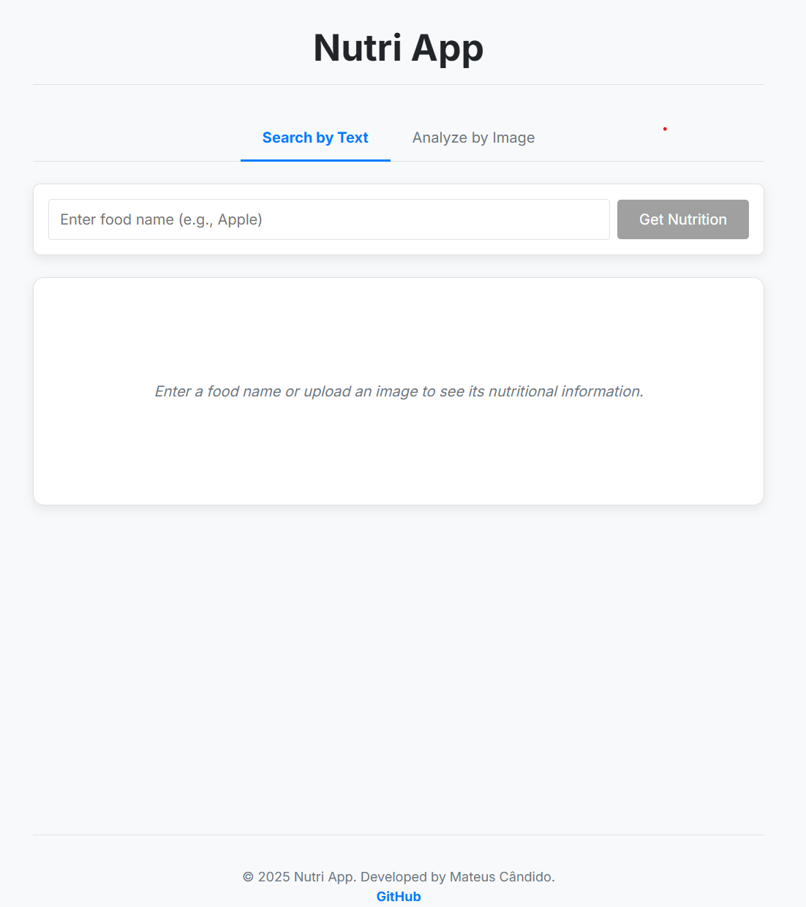

# Nutri App 🥗

A smart nutritional analysis application powered by Google's Gemini AI. This project allows users to get approximate nutritional information for food items either by typing a name or by uploading an image.

The core of this application is its integration with a multimodal AI model, demonstrating modern frontend development practices and advanced API communication.




## ✨ Key Features

* **Dual Mode Analysis:** Get nutritional data in two ways:
    * **Text-based Search:** Enter a food's name (e.g., "100g of grilled chicken") for a detailed breakdown.
    * **Image Analysis:** Upload a photo of your meal, and let the AI identify the food and provide its nutritional information.
* **Structured Data with AI:** Leverages advanced prompt engineering to instruct the Gemini model to return clean, structured JSON data, making the response reliable and easy to parse.
* **Modern & Responsive UI:** A clean, component-based interface built with React and TypeScript, ensuring a smooth user experience.
* **Defensive Error Handling:** The application is built to gracefully handle potential inconsistencies in the AI's response, such as invalid JSON or incomplete data, preventing crashes.

## 🚀 Tech Stack

This project was built using a modern set of tools and libraries:

* **React:** For building the user interface with a component-based architecture.
* **TypeScript:** To ensure type safety and code robustness.
* **Vite:** A blazing-fast build tool for the development environment.
* **@google/generative-ai:** The official SDK to interact with the Google Gemini API.
* **CSS Modules:** For component-scoped and conflict-free styling.

## 🛠️ Getting Started

To run this project on your local machine, follow the steps below.

### Prerequisites

* [Node.js](https://nodejs.org/en/) (v16 or higher)
* [Git](https://git-scm.com/)
* A **Google Gemini API Key**.

### Environment Setup

This project requires a Google Gemini API key to function.

1.  Obtain your free API key from [Google AI Studio](https://aistudio.google.com/).
2.  In the root directory of the project, create a new file named `.env.local`.
3.  Add your API key to this file as follows:
    ```
    VITE_GEMINI_API_KEY=YOUR_API_KEY_HERE
    ```
4.  The `.env.local` file is included in `.gitignore` and should **never** be committed to version control.

### Installation & Running

1.  **Clone the repository:**
    ```bash
    git clone [https://github.com/MateCandido/nutri-app.git](https://github.com/MateCandido/nutri-app.git)
    ```
    *(Replace `nutri-app` with your repository name if different)*

2.  **Navigate to the project directory:**
    ```bash
    cd nutri-app
    ```

3.  **Install the dependencies:**
    ```bash
    npm install
    ```

4.  **Run the application:**
    ```bash
    npm run dev
    ```

5.  Open your browser and navigate to `http://localhost:5173` (or the address shown in your terminal).

---

Made with ❤️ by **Mateus Cândido**. Let's connect!

[](https://www.linkedin.com/in/mateus-cândido-b8b06a280)
[](https://github.com/MateCandido)